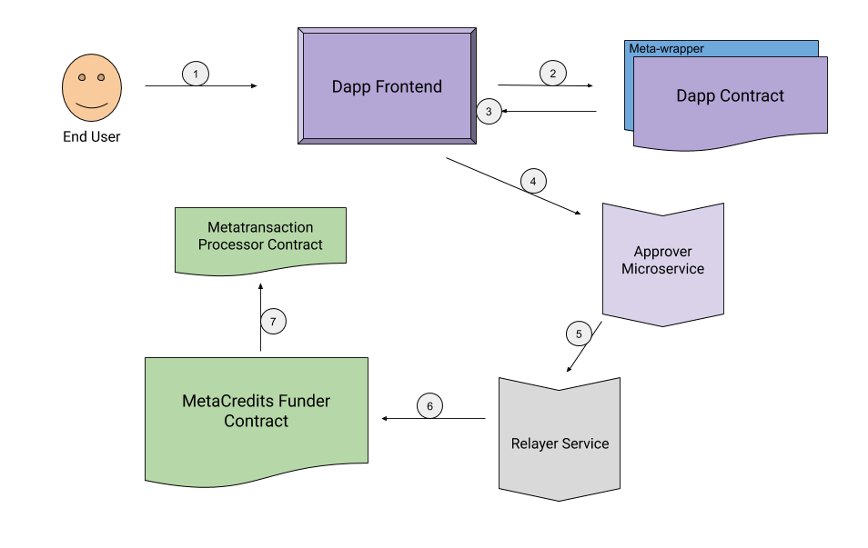

# MetaCredits

MetaCredits is a product designed to allow developers and end users with a 0 balance of any crypto currency to participate in the growing ethereum ecosystem.

## Repositories

 - [MetaCred Smart Contracts](https://github.com/MetaCredits/metacredits-contracts) - Core Solidity smart contracts of the MetaCred product
 - [MiniDAO Example Smart Contracts](https://github.com/MetaCredits/mini-dao-example/tree/master/minidao-contracts) - an example dapp to demostrate how a Dapp developer team would interact with the system
 - [Relayer Service](https://github.com/MetaCredits/microservices/tree/master/relayer) - AWS lambda microservice for representing a relay pool in our use case
 - [MetaTransaction Approver Service](https://github.com/MetaCredits/microservices/tree/master/metatransaction-approver) - AWS lambda microservice for Dapp Developers to sign their approval of a metatransacaction for their dapp
 - [Example Dapp: MiniDAO](https://github.com/MetaCredits/mini-dao-example/tree/master/minidao-dapp) - Simplistic Example Dapp featuring seemless metacredit metatransactions

## Project Mission

We want to create meaningful "on-ramps" into the ethereum ecosystem for developers with limited or no access to cryptocurrency. Our system is designed to allow these developers and their potential end users to be able to interact with the ethereum blockchain in a real and meaningful way (layer 1 transactions) without ever needing to own a single wei. The gas for their transactions will be payed by beneficiaries who are interested in growing the ecosystem and being charitable while feeling secure in (coded) guarentees as to how their funds would be spent by the benefactor.

## High Level Technical Architecture

1. End User (with 0 eth balance) performs an action via the developer's front end Dapp
2. Dapp front end uses the abi of the deployed contract to create a metatransaction object
3. User signs a message through the Dapp's web3 provider
4. The signed message (metatransaction) is sent to the developer's approver microservice where the transaction is parsed and the parameters are used to determine if the dapp developer would like to use his metacredit funding to pay for the transaction
5. Dapp developer sends his signature of approval as well as the signed metatransaction to a relay service
6. The relayer pays the gas fee to execute the metatransaction via the metacredits contract, this ensures that he is payed back in full by the contract before the transaction ends.
7. After validating that the signature submitted alongside the metatransaction matches the dapp developer, the contract forwards the metatransaction to the actual processor contract to execute the metatransaction normally

## Presentation Slides

https://docs.google.com/presentation/d/1j3yCWUTdNgZTGvF94Jbjndc7oqDN5890fnBZU_Ol2zc/edit?usp=sharing
