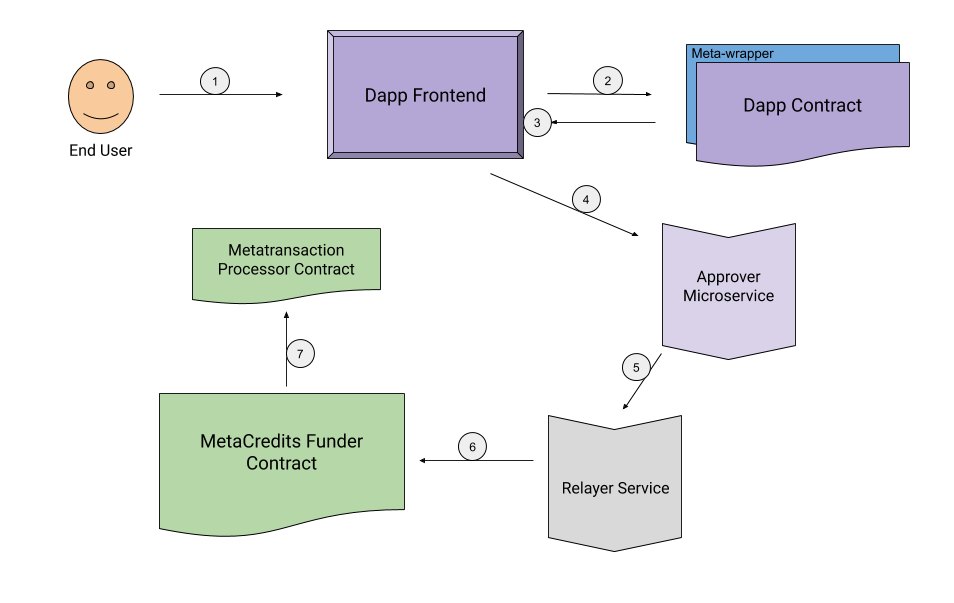

# MetaCredits Hello, World Blog Post

## Intro

A couple weeks ago, I participated in the Eth Denver Hackathon. Together, my team and I came up with the idea to build “MetaCredits”, a smart contract designed to automatically fund the gas to execute metatransactions. Metatransactions are unique from regular transactions in that the user who is creating the transaction (signed data) is not posting it as a transaction to the blockchain. The user instead is sending the message to a relayer service, which will pay for the gas to execute the transaction the user signed.  For more about metatransactions check out [Austin Griffith's medium post](https://medium.com/@austin_48503/ethereum-meta-transactions-90ccf0859e84).

## Design Rationale

Metatransactions are super useful because they allow Dapp developers to pay for their users transactions, lowering the barriers to end users interacting with their Dapp and the ethereum mainnet blockchain. Now Dapp users do not have to acquire eth necessary to pay transaction fees, the Dapp developer can choose to pay this gas cost while still allowing the user to sign the transaction and ensure that the system remains decentralized.

But what if a Dapp Developer does not have access to ether? Our solution aims to build a bridge to these Dapp developers who may not be able to afford an amount of ethereum they need to fund their Dapp's initialization or who may live in a country with strict KYC laws and are not able to exchange their currency for ether. These developers can now request to be funded via the MetaCredits smart contract and benefactors with the means to pay the fees for these bootstrapping transactions can safely fund the developers via MetaCredits.

A small amount of gas can go a long way...the 0.02 eth that you spent on `helloworld.eth` ENS domain could pay for a number of small transactions on a smart contract. We believe that there is enough goodwill and benevolence across the ethereum ecosystem that this model would be very helpful in bringing needy dapp developers together with benefactors/sponsors who are willing to help get their app off the ground with minimal costs.

## Technical Components

There are a number of modular components in the MetaCredits solution.

### Developer Dapp
The developer creates a metatransaction enabled smart contract and builds a Dapp. Without ether, they can't deploy their dapp to mainnet, but they can acquire free testnet ether and test out their dapps on one of the test networks.

### Dapp Approver Microservice
The Dapp developer can run this tiny lightweight service to verify that the signed metatransaction from his end users match the parameters of transactions he is willing to fund. 

### Relayer Microservice
This service contains a funded wallet which will execute the transaction by calling a function on the MetaCredit Funder Contract.

### MetaCredit Funder Contract
This contract is funded by a benefactor and the funds inside will be used to repay relayers in full for the gas they spend to execute the metatransaction.

### High Level Flow
1. End User (with 0 eth balance) performs an action via the developer's front end Dapp
2. Dapp front end uses the abi of the deployed contract to create a metatransaction object
3. User signs a message through the Dapp's web3 provider
4. The signed message (metatransaction) is sent to the developer's approver microservice where the transaction is parsed and the parameters are used to determine if the dapp developer would like to use his metacredit funding to pay for the transaction
5. Dapp developer sends his signature of approval as well as the signed metatransaction to a relay service
6. The relayer pays the gas fee to execute the metatransaction via the metacredits contract, this ensures that he is payed back in full by the contract before the transaction ends.
7. After validating that the signature submitted alongside the metatransaction matches the dapp developer, the contract forwards the metatransaction to the actual processor contract to execute the metatransaction normally

### Design considerations

 - 0 Ether required for Dapp developers and their end users to use public/private key pairs to interact with mainnet dapps
 - Relayer is guaranteed by the funded contract to recieve a full refund
 - Dapp developers can have relative sovereignty over their creations, using an approver to filter only specific transaction types they want to fund
 - Benefactors can be sure their funds will only be spent on the gas to fund the dapps of their choosing, and can stop the contract and refund their gas if they so choose
 - Metatransaction library extending the web3 functionality of ethers.js to ensure that dapp developers do not have to change patterns to work with the metacredit system ([meta-ethers](https://github.com/rapid-eth/meta-ethers))
 - Metatransaction processor agnosticism implicitly built into design (can use any/multiple metatransaction schemas)
 - Dapp funder contracts can continue to be funded by outside beneficiaries if the original benefactor funds run dry
 
 
### Future plans

Seeing as MetaCredits was concieved and built nearly from scratch in one weekend, there is still a lot of cleaning up to do of the the code base and small but powerful features that will be added. If you want to experience what its like interacting with a "MetaCredit-ified" Dapp check out the simple MiniDAO app at http://minidao.metacredits.io
